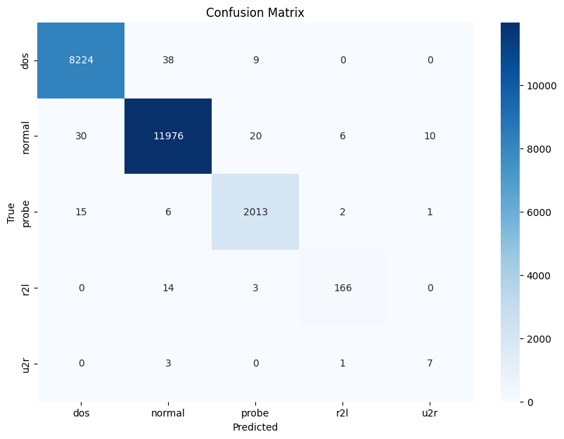

# Detecção de Intrusão em Redes com Machine Learning

---

## 📖 Índice

- [Sobre o Projeto](#sobre-o-projeto)
- [Datasets Analisados](#datasets-analisados)
- [NSL-KDD](#nsl-kdd)
- [UNSW-NB15](#unsw-nb15)
- [CIC-IDS-2017](#cic-ids-2017)

---

## 🚀 Sobre o Projeto

Através de datasets que reúnem dados variados de tráfego normal e anormal, podemos tanto aprender padrões de ataques cibernéticos, como usar o Machine Learning para treinar a IA para identificá-los. Isso pode se mostrar especialmente útil em plataformas **SIEM** (Security Information and Event Management), que normalmente utilizam de regras de correlação fixas (ex.: `SE flag == 'S0' E serror_rate > 0.9 ENTÃO DoS`), mas com sua modernização, podem ser integradas a esses modelos de IA treinados que podem identificar até mesmo ataques mais sutis e ameaças novas (zero-day).

Este projeto tem o objetivo de utilizar técnicas de Machine Learning para o treino desses modelos e também entender mais sobre esses ataques, em um estudo misto de Ciência de Dados/IA e Cibersegurança/Redes. É um estudo não necessariamente focado em encontrar a melhor solução para cada caso, mas em explorar soluções e técnicas, entender o comportamento das anomalias por meio de análises estatísticas e construir uma boa base nesses temas fazendo estudos complementares que venham a ser úteis para a verdadeira compreensão do caso.

As análises são feitas originalmente no Google Colab e estão com uma cópia neste repositório (o link para o Colab está no início da cópia). Não há só código, mas explicação do código e dos conceitos utilizados neste. Para cada um, existe uma versão em inglês e uma em português.

---

## 📊 Datasets Analisados

Os datasets utilizados nesse projeto são:

### 1. NSL-KDD
* **Status:** Finalizado
* **Descrição:** Uma versão de 2009 aprimorada do clássico KDD'99 (1998/1999). É notório por seu desbalanceamento de classes e pelo **"Concept Drift"** (diferenças estatísticas significativas) entre os conjuntos de treino e teste.

### 2. UNSW-NB15
* **Status:** Em andamento
* **Descrição:** --

### 3. CIC-IDS-2017
* **Status:** A iniciar
* **Descrição:** --

---

## 1️⃣ NSL-KDD

* **Pré-processamento:** One-Hot Encoding para categóricas (`protocol_type`, `service`, `flag`) + Padronização (`StandardScaler`) "Linha de Base Pura" (treinada apenas no tráfego 'normal').
* **Metodologia Principal:** Engenharia de features para a criação de 4 "Risk Scores" (`dos`, `probe`, `r2l`, `u2r`) baseados na soma ponderada dos Z-Scores das **Top 7 features** mais relevantes do heatmap.
* **Modelo:** LightGBM (LGBM) com `is_unbalance=True`, treinado no dataset completo (122 features + 4 "Risk Scores").

**Resultados (Conjunto de Teste):**

| Classe | Precision | Recall | F1-Score | Support |
| :--- | :---: | :---: | :---: | :---: |
| **dos** | 0.99 | 0.99 | 0.99 | 8271 |
| **normal** | 0.99 | 0.99 | 0.99 | 12042 |
| **probe** | 0.98 | 0.99 | 0.99 | 2037 |
| **r2l** | 0.95 | 0.91 | 0.93 | 183 |
| **u2r** | 0.39 | 0.64 | 0.48 | 11 |
| | | | | |
| **accuracy** | | | **0.99** | **22544** |
| **macro avg** | 0.86 | 0.90 | 0.88 | 22544 |
| **weighted avg** | 0.99 | 0.99 | 0.99 | 22544 |

**Conclusões:**

O desafio central do NSL-KDD é o desbalanceamento extremo e o "Concept Drift" (o conjunto de teste contém 17 ataques que não existem no treino). Uma abordagem de baseline falha completamente (F1-Macro < 0.50).

A metodologia de "Risk Score" se provou **altamente eficaz**. A análise de importância das features mostrou que as "Risk Scores" que criamos (especialmente `u2r_risk_score` e `r2l_risk_score`) estavam entre as features mais importantes para o modelo LGBM.

O resultado final (F1-Macro de 0.88) é excelente, com performance quase perfeita nas classes de alto volume e uma melhoria drástica nas classes raras. O modelo identificou 64% dos ataques `u2r` (contra ~2% do baseline) e 91% dos `r2l`, com uma precisão muito alta (95%).

---

## 2️⃣ UNSW-NB15

* **Pré-processamento:** --
* **Metodologia Principal:** --
* **Modelo:** --

**Resultados (Conjunto de Teste):**

--

**Conclusões:**

--

---

## 3️⃣ CIC-IDS-2017

* **Pré-processamento:** --
* **Metodologia Principal:** --
* **Modelo:** --

**Resultados (Conjunto de Teste):**

--

**Conclusões:**

--

---
